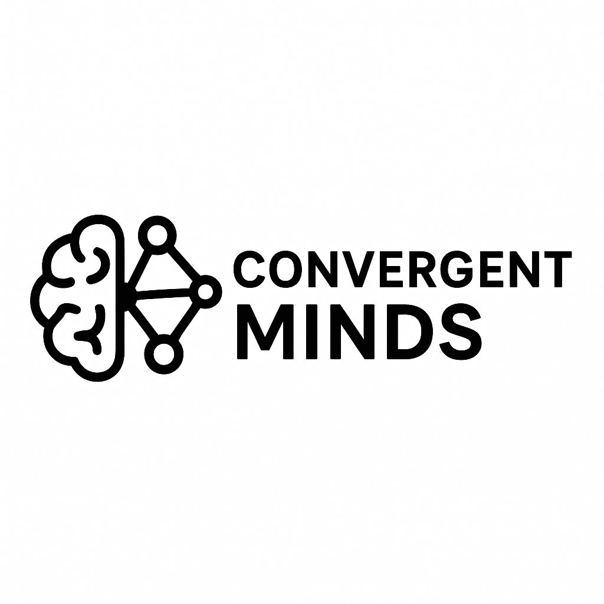

# Convergent Minds



**Convergent Minds** is a research platform for evaluating computational models of language on their alignment with human brain activity and behavior. This repository provides tools to:

- **Score language models** against neural and behavioral benchmarks
- **Localize language-selective units** in neural networks
- **Measure brain alignment** of model representations with fMRI data

The platform is built on top of Brain-Score and provides a simplified, modular API for researchers working at the intersection of neuroscience and AI.

## Features

- 🧠 **Neural Benchmarks**: Evaluate models on fMRI datasets (Pereira2018, Fedorenko2016, etc.)
- 🎯 **Localization**: Identify language-selective units using functional localizers
- 🤖 **Model Support**: Easy integration with HuggingFace models and custom architectures
- 📊 **Behavioral Tasks**: Test models on reading times, next-word prediction, and more

## Quick Start

### Installation

```bash
pip install -e "."
```

### Basic Usage

Score a model on a benchmark:

```bash
python main.py --model distilgpt2 --benchmark Pereira2018.384sentences-cka
```

Use an untrained model:

```bash
python main.py --model distilgpt2 --untrained --benchmark Pereira2018.384sentences-cka
```

Perform localization before scoring:

```bash
python main.py --model distilgpt2 --localize --num-units 1000 --benchmark Pereira2018.384sentences-cka
```

## Repository Structure

```
convergent-minds/
├── brainscore/          # Core library for benchmarks, metrics, and data
├── models/              # Model implementations (GPT, RNNG, etc.)
├── alignment/           # Brain alignment scoring scripts
├── localization/        # Language localization tools
├── scripts/             # Utility scripts
└── main.py             # Main entry point for scoring
```

## Advanced Usage

### Brain Alignment Scoring

For more advanced brain alignment analysis:

```bash
python alignment/score_brain_alignment.py \
    --model-name gpt2 \
    --benchmark-name Pereira2018.384sentences-cka \
    --savepath scores.pkl
```

### Custom Models

You can easily integrate custom models by implementing the `ArtificialSubject` interface. See the `models/` directory for examples.

## Available Benchmarks

- **Pereira2018**: fMRI responses to sentences
- **Fedorenko2016**: Language network localization
- **Futrell2018**: Reading time predictions
- **SyntaxGym2020**: Syntactic generalization tests

## Contributing

Contributions are welcome! Please feel free to submit a Pull Request.

## License

MIT License

## Citation

If you use this code in your research, please cite:

```bibtex
@software{convergent_minds,
  title = {Convergent Minds: A Platform for Brain-Aligned Language Models},
  author = Minniti, J,
  year = {2024},
  url = {https://github.com/jacopo-minniti/convergent-minds}
}
```

## Acknowledgments

This project builds upon [Brain-Score](https://www.brain-score.org/) and incorporates research from the neuroscience and NLP communities.
